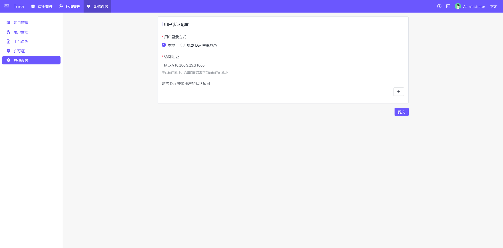

## 系统介绍

Tuna 是一个现代化的软件交付平台，它可以让你的应用交付在当今流行的混合、多云环境中变得更加简单、高效、可靠。
Tuna 是基础设施无关的、可编程的，但最重要的是： 它是完全以应用为中心的。它可以帮助你构建多样化的云原生应用，并交付到任意的云和基础设施

## 登录系统

使用用户名和密码登录系统。

## 应用市场

默认登录系统进入应用市场，应用市场支持查看不同仓库源内的应用列表信息、版本信息、详情等。
点击生成应用可以快速创建应用。应用市场数据源仓库切换在右上角，支持常用的私有helm类型的仓库。

## 创建应用

点击生成应用，可以快速创建应用，填写必要参数点击创建，会自动跳转到应用管理的应用详情中。

在应用详情中可以进行更详细的组件、策略、触发器、版本查看和工作等的管理，默认硬件创建后没有部署，可以点击部署进行实际安装。

点击部署后，会自动跳转到环境信息子标签页，支持工作流、状态、实例、日志等管理。

至此一个最简单的应用就部署成功。

## 环境管理

环境信息为一个逻辑聚合的定义，用来将项目和实际运行的底层空间进行一对多的绑定。

新增环境

运行空间为实际定义云原生环境的命名空间，为一一对应的关系。

新增运行环境，创建与底层云原生环境的关联。

集群管理，平台支持多个云原生集群聚合的管理。

仓库管理，平台支持不同类型的仓库管理，用户可以根据自己的需求新增和调整。

新增仓库

## 系统设置

系统设置中包含：项目管理、用户管理、平台角色、许可证和其他配置

项目管理用于管理用户和应用，可以起到隔离的作用。

用户管理创建用于本地登录的用户信息，支持用户名称、密码、邮箱的管理。

新建用户信息

平台角色用于定义平台内资源与项目用户的权限关系。

新增角色

许可证为平台授权许可有效期限，过期后仅可以查看和删除原有应用，不支持新增应用等高级功能。

其他设置内支持用户登录方式配置和访问地址配置，一般不需要特殊调整。

